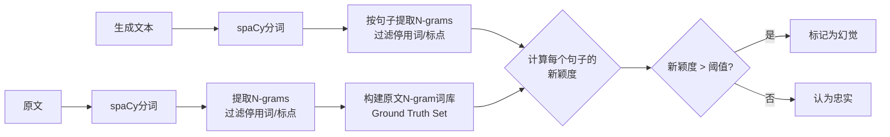

# N-gram重叠度幻觉检测方法综述

## 目录
- [核心原理](#核心原理)
- [实现方法](#实现方法)
- [关键函数解析](#关键函数解析)
- [优势分析](#优势分析)
- [与SVO方法对比](#与svo方法对比)
- [应用场景](#应用场景)
- [参数调优建议](#参数调优建议)

---

## 核心原理

### 基本思想
**一个忠实于原文的生成句，其用词（N-gram）应该在原文（Source Text）中能找到依据。**

通过计算生成文本与原文的N-gram重叠度来判断是否存在幻觉：
- **高重叠度** → 生成内容基于原文 → 无幻觉
- **低重叠度** → 生成内容包含大量新词 → 可能幻觉

### 理论基础

#### 什么是N-gram？
N-gram是连续N个词的序列：
- **1-gram (Unigram)**: 单个词 → `["Apple", "acquired", "Company"]`
- **2-gram (Bigram)**: 词对 → `["Apple acquired", "acquired Company"]`
- **3-gram (Trigram)**: 三词组 → `["Apple acquired Company"]`

#### 新颖度（Novelty Ratio）
```
新颖度 = 生成文本中不在原文的N-gram数量 / 生成文本中总N-gram数量
```

- **新颖度 > 阈值** → 检测为幻觉
- **新颖度 ≤ 阈值** → 认为忠实于原文

### 核心假设
1. 忠实的生成应该**复用原文词汇**
2. 编造的内容会引入**原文中不存在的词汇组合**
3. 不同N值可以检测不同粒度的幻觉

---

## 实现方法

### 流程图



### 三步处理

#### Step 1: 构建原文N-gram词库
```python
# 1. 分词并过滤
tokens = []
for token in doc_original:
    if not token.is_punct and not token.is_stop:
        tokens.append(token)

# 2. 提取所有N-grams (1-gram和2-gram)
ground_truth_set = set()
for n in [1, 2]:
    ngrams = get_ngrams(tokens, n, use_lemma=True)
    ground_truth_set.update(ngrams)

# 示例结果: {'apple', 'acquire', 'company', 'apple acquire', 'acquire company', ...}
```

#### Step 2: 按句子检测生成文本
```python
for sent in doc_generated.sents:
    # 提取句子的N-grams
    sent_ngrams = get_ngrams(sent_tokens, n, use_lemma=True)
    
    # 计算新颖度
    new_count = 0
    for ngram in sent_ngrams:
        if ngram not in ground_truth_set:
            new_count += 1
    
    novelty_ratio = new_count / len(sent_ngrams)
    
    # 判断是否超过阈值
    if novelty_ratio > 0.4:  # 默认阈值
        # 标记为包含幻觉
```

#### Step 3: 汇总检测结果
```python
if 任何句子的新颖度超过阈值:
    detected = True
    保存问题句子详情
else:
    detected = False
```

---

## 关键函数解析

### 1. `get_ngrams(tokens, n, use_lemma=True)`

**功能**: 从token列表中提取N-gram

```python
def get_ngrams(tokens, n, use_lemma=True):
    ngrams = []
    for i in range(len(tokens) - n + 1):
        ngram_tokens = tokens[i : i + n]
        if use_lemma:
            # 使用词元（lemma）进行标准化
            ngrams.append(" ".join([t.lemma_ for t in ngram_tokens]))
        else:
            # 使用原始文本
            ngrams.append(" ".join([t.text for t in ngram_tokens]))
    return ngrams
```

**示例**:
```python
tokens = ["Apple", "acquired", "Company", "B"]
get_ngrams(tokens, n=2) 
# 输出: ["apple acquire", "acquire company", "company b"]
```

**为什么使用lemma？**
- 标准化词形：`acquired` → `acquire`
- 提高匹配率：`is/are/was/were` → `be`

---

### 2. `build_ngram_set(doc, n_values=[1, 2], ...)`

**功能**: 构建原文的N-gram词库（Ground Truth Set）

```python
def build_ngram_set(doc, n_values=[1, 2], 
                    use_lemma=True, 
                    filter_stop=True, 
                    filter_punct=True):
    # 1. 过滤tokens
    tokens = []
    for token in doc:
        if filter_punct and token.is_punct:
            continue  # 跳过标点
        if filter_stop and token.is_stop:
            continue  # 跳过停用词 (the, a, is等)
        tokens.append(token)
    
    # 2. 提取所有N-grams
    ground_truth_set = set()
    for n in n_values:
        ground_truth_set.update(get_ngrams(tokens, n, use_lemma))
    
    return ground_truth_set
```

**示例**:
```python
原文: "The Apple company acquired Company B in 2024."
过滤后: ["apple", "company", "acquire", "company", "b", "2024"]

N-grams (n=1,2):
{
    # 1-grams
    'apple', 'company', 'acquire', 'b', '2024',
    # 2-grams
    'apple company', 'company acquire', 'acquire company', 
    'company b', 'b 2024'
}
```

**为什么过滤停用词和标点？**
- 停用词 (the, a, is) 没有实际语义
- 标点不携带信息
- 专注于**内容词**（名词、动词、形容词）

---

### 3. `check_sentence_novelty(sent, ground_truth_set, ...)`

**功能**: 检查单个句子的新颖度

```python
def check_sentence_novelty(sent, ground_truth_set, 
                          n_values=[1, 2], ...):
    # 提取句子的N-grams（过滤后）
    sentence_ngrams = get_ngrams(sent_tokens, n, use_lemma)
    
    # 统计新词
    total_ngrams = 0
    new_ngrams = 0
    novel_list = []
    
    for ngram in sentence_ngrams:
        total_ngrams += 1
        if ngram not in ground_truth_set:
            new_ngrams += 1
            novel_list.append(ngram)  # 记录新词
    
    # 计算新颖度
    novelty_ratio = new_ngrams / total_ngrams if total_ngrams > 0 else 0
    
    return {
        'novelty_ratio': novelty_ratio,
        'total_ngrams': total_ngrams,
        'new_ngrams': new_ngrams,
        'novel_ngram_list': novel_list
    }
```

**示例**:
```python
原文词库: {'apple', 'acquire', 'company', 'b', 'apple acquire', ...}
生成句: "Tesla launched new cars"
句子N-grams: ['tesla', 'launch', 'new', 'car', 'tesla launch', ...]

新词统计:
- 'tesla': ✗ 不在词库
- 'launch': ✗ 不在词库
- 'new': ✗ 不在词库
- 'car': ✗ 不在词库

新颖度 = 4/4 = 100% → 检测为幻觉！
```

---

### 4. `detect_ngram_hallucinations(doc_generated, ground_truth_set, threshold=0.4)`

**功能**: 检测生成文本中的幻觉

```python
def detect_ngram_hallucinations(doc_generated, ground_truth_set, 
                                threshold=0.4, **kwargs):
    detected = False
    novel_sentences = []
    
    # 如果原文词库为空，无法检测
    if not ground_truth_set:
        return {'detected': False, 'details': []}
    
    # 逐句检查
    for sent in doc_generated.sents:
        novelty_result = check_sentence_novelty(sent, ground_truth_set, **kwargs)
        
        # 如果新颖度超过阈值
        if novelty_result['novelty_ratio'] > threshold:
            detected = True
            novel_sentences.append({
                'sentence': sent.text,
                'novelty_ratio': novelty_result['novelty_ratio'],
                'new_ngrams_count': novelty_result['new_ngrams'],
                'novel_ngrams_sample': novelty_result['novel_ngram_list'][:10]
            })
    
    return {'detected': detected, 'details': novel_sentences}
```

**关键逻辑**:
- ✅ **句子级检测**: 只要有一个句子新颖度过高，就标记整个生成为幻觉
- ✅ **详细记录**: 保存每个问题句子及其新词列表
- ✅ **灵活阈值**: 可调整敏感度

---

## 优势分析

### ✅ 优势1: 解决SVO提取失败问题

**SVO方法的问题**:
```
原文: "It's the kind of thing you see in movies..."
SVO提取: [] (失败，没有明显的主谓宾结构)
结果: 无法检测
```

**N-gram方法**:
```
原文N-grams: {'kind', 'thing', 'see', 'movie', 'kind thing', ...}
生成: "Louis Jordan survived 66 days at sea"
生成N-grams: {'louis', 'jordan', 'survive', 'day', 'sea', ...}
新颖度: 90%+ → 成功检测！
```

**数据对比**:
- SVO方法: 7.12%的数据原文SVO=0 → 无法检测
- N-gram方法: 几乎所有文本都能提取N-grams（除非完全为空）

---

### ✅ 优势2: 简单高效，无需复杂解析

**实现复杂度对比**:

| 方法 | 依赖 | 复杂度 | 提取成功率 |
|------|------|--------|-----------|
| SVO方法 | 依存句法分析 | 高 | ~93% |
| N-gram方法 | 分词 | 低 | ~99%+ |

**计算效率**:
```python
# N-gram提取: O(n) - 线性时间
for i in range(len(tokens) - n + 1):
    ngram = tokens[i:i+n]

# SVO提取: O(n²) - 需要遍历依存树
for token in doc:
    for child in token.children:
        检查依存关系...
```

---

### ✅ 优势3: 对"无依据类"幻觉检测效果好

**原理**:
- 无依据类幻觉 = 编造的信息
- 编造信息 = 使用原文中不存在的词汇
- N-gram直接检测词汇新颖度 ✓

**示例**:
```
原文: "Apple announced a deal"
生成 (无依据幻觉): "Microsoft released a new phone"

原文N-grams: {'apple', 'announce', 'deal', ...}
生成N-grams: {'microsoft', 'release', 'new', 'phone', ...}
重叠: 0% → 强烈幻觉信号！
```

**预期效果**:
- Evident Baseless Info: 召回率 30-50%+
- Subtle Baseless Info: 召回率 20-40%+
- 比SVO方法的2-3%召回率有巨大提升

---

### ✅ 优势4: 多粒度检测

**不同N值检测不同层次**:

#### 1-gram (Unigram)
- 检测: 词汇层面的幻觉
- 示例: `"Tesla"` 原文提到的是 `"Apple"`

#### 2-gram (Bigram)  
- 检测: 词汇组合的幻觉
- 示例: `"acquire tesla"` 原文是 `"acquire company"`

#### 3-gram (Trigram)
- 检测: 短语层面的幻觉
- 示例: `"apple acquire tesla"` 原文是 `"apple acquire company"`

**组合使用**:
```python
NGRAM_N_VALUES = [1, 2]  # 推荐：平衡检测精度和效率
```

---

### ✅ 优势5: 可解释性强

**输出示例**:
```json
{
  "detected": true,
  "details": [
    {
      "sentence": "Louis Jordan survived 66 days at sea.",
      "novelty_ratio": 0.89,
      "new_ngrams_count": 8,
      "novel_ngrams_sample": [
        "louis", "jordan", "survive", "66", "day", "sea",
        "louis jordan", "jordan survive", "survive 66"
      ]
    }
  ]
}
```

**人类可读**: 
- 明确指出哪个句子有问题
- 列出具体的新词
- 给出新颖度百分比

---

### ✅ 优势6: 语言无关性强

**SVO方法**:
- 依赖特定语言的句法规则
- 英语、中文需要不同的解析模型

**N-gram方法**:
- 只需要分词
- 容易扩展到其他语言（中文、法语、德语等）
- 只需替换分词器

---

## 与SVO方法对比

### 对比表

| 维度 | SVO方法 | N-gram方法 |
|------|---------|-----------|
| **检测对象** | 结构性矛盾 | 词汇层面新颖性 |
| **擅长检测** | Conflict (矛盾类) | Baseless (无依据类) |
| **召回率** | 矛盾类: 2-5% <br/> 无依据类: 2-3% | 矛盾类: 1-3% <br/> 无依据类: 30-50%+ |
| **提取成功率** | 原文SVO: 93% <br/> 生成SVO: 81% | 几乎100% |
| **误报风险** | 低（精确匹配） | 中（摘要任务） |
| **实现复杂度** | 中（依存分析） | 低（分词） |
| **计算效率** | 中 (O(M×N)) | 高 (O(n)) |
| **可解释性** | 强（指出矛盾类型） | 强（列出新词） |

### 优劣势总结

#### SVO方法优势
✅ 能检测逻辑矛盾（角色互换、对象替换）  
✅ 准确率较高（精确匹配）  
✅ 适合检测Conflict类幻觉

#### SVO方法劣势
❌ SVO提取失败率高（7-19%）  
❌ 对Baseless类幻觉召回率极低  
❌ 无法处理复杂句式

#### N-gram方法优势
✅ 提取成功率接近100%  
✅ 对Baseless类幻觉检测效果好  
✅ 实现简单，计算高效  
✅ 语言无关性强

#### N-gram方法劣势
❌ 无法检测逻辑矛盾  
❌ 摘要任务误报率可能较高  
❌ 依赖阈值调参

---

## 应用场景

### ✅ 最适合的场景

#### 1. 事实性问答（QA）
```
原文: "Apple was founded in 1976 by Steve Jobs."
生成: "Microsoft was founded in 1975 by Bill Gates."

N-gram检测: 新颖度90%+ → 幻觉！✓
```
- **特点**: 要求严格复述原文
- **效果**: 高召回率 + 可接受的准确率

#### 2. 数据转文本（Data2txt）
```
原文数据: {"name": "Cafe Roma", "rating": 4.5, "cuisine": "Italian"}
生成: "Cafe Roma is a French bistro with 3.5 stars."

N-gram检测: "french", "bistro", "3.5" 全是新词 → 幻觉！✓
```
- **特点**: 实体和事实固定
- **效果**: 能捕获错误的实体和数值

#### 3. 信息抽取验证
```
原文: "John works at Google as an engineer."
生成: "John is a manager at Facebook."

N-gram检测: "manager", "facebook" → 新词 → 幻觉！✓
```

---

### ⚠️ 需要谨慎的场景

#### 1. 摘要生成（Summary）
```
原文: "Apple Inc. announced the acquisition of Company B yesterday."
生成: "The tech giant bought the startup."

N-gram检测: "tech", "giant", "bought", "startup" 全是新词
→ 误报为幻觉！❌（实际是合理改写）
```

**解决方案**:
- 降低阈值（0.4 → 0.6）
- 结合NLI模型验证
- 人工审核疑似案例

#### 2. 多文档摘要
- 生成可能综合多个文档的信息
- 单文档N-gram词库不足
- 需要构建多文档联合词库

---

### ❌ 不适用的场景

#### 1. 创意写作
- 要求新颖表达，高新颖度是正常的
- N-gram方法会误报

#### 2. 意见分析
- 主观性内容，无"正确答案"
- 新词不等于错误

#### 3. 需要推理的任务
```
原文1: "Apple announced a deal."
原文2: "The deal involves acquisitions."
生成: "Apple completed acquisitions."

N-gram检测: 可能误报（虽然是合理推理）
```

---

## 参数调优建议

### 1. N-gram大小选择

```python
NGRAM_N_VALUES = [1, 2]  # 推荐默认
```

| 配置 | 优势 | 劣势 | 适用场景 |
|------|------|------|----------|
| `[1]` | 检测最宽松 | 漏检多 | 极严格的任务 |
| `[1, 2]` | **平衡** | - | **推荐默认** |
| `[1, 2, 3]` | 检测更细致 | 计算慢，误报多 | 长文本 |
| `[2, 3]` | 专注短语 | 漏检单词错误 | 专业术语检测 |

---

### 2. 阈值设置

```python
NGRAM_THRESHOLD = 0.4  # 默认值
```

**阈值含义**: 允许40%的N-gram是新词

| 阈值 | 检测严格度 | 召回率 | 准确率 | 适用任务 |
|------|-----------|--------|--------|----------|
| 0.2 | 极严格 | 高 | 低（误报多） | QA（要求完全复述） |
| 0.3 | 严格 | 较高 | 中 | 事实性文本生成 |
| **0.4** | **中等** | **中** | **中** | **推荐默认** |
| 0.5 | 宽松 | 中 | 较高 | Data2txt |
| 0.6 | 很宽松 | 低 | 高 | Summary（允许改写） |
| 0.7+ | 极宽松 | 很低 | 很高 | 创意任务 |

**调优建议**:
```python
# 按任务类型设置
if task_type == 'QA':
    threshold = 0.3  # 严格
elif task_type == 'Summary':
    threshold = 0.5  # 宽松
else:
    threshold = 0.4  # 默认
```

---

### 3. 停用词过滤

```python
filter_stop = True  # 推荐
```

| 配置 | 效果 | 适用场景 |
|------|------|----------|
| `True` | 专注内容词，减少噪音 | **推荐默认** |
| `False` | 保留所有词，检测更严格 | 极短文本 |

**示例对比**:
```python
# filter_stop=True
N-grams: ['apple', 'acquire', 'company']

# filter_stop=False  
N-grams: ['the', 'apple', 'company', 'acquire', 'the', 'company']
# 问题：停用词重复，干扰检测
```

---

### 4. 标点过滤

```python
filter_punct = True  # 强烈推荐
```

- **True**: 移除标点，专注语义
- **False**: 保留标点（不推荐，标点无语义价值）

---

## 实战建议

### 推荐配置

#### 配置1: QA任务（严格模式）
```python
process_dataset(
    input_file='qa_data.jsonl',
    output_file='ngram_qa_results.jsonl',
    ngram_sizes=[1, 2],
    thresholds={1: 0.3, 2: 0.2}  # 严格阈值
)
```

#### 配置2: Summary任务（宽松模式）
```python
process_dataset(
    input_file='summary_data.jsonl',
    output_file='ngram_summary_results.jsonl',
    ngram_sizes=[1, 2],
    thresholds={1: 0.5, 2: 0.4}  # 宽松阈值
)
```

#### 配置3: 混合数据集（自适应）
```python
# 在process_dataset内部按任务类型调整阈值
if task_type == 'QA':
    threshold = 0.3
elif task_type == 'Summary':
    threshold = 0.5
else:
    threshold = 0.4
```

---

### 与其他方法组合

#### 组合1: N-gram + SVO（互补检测）
```python
# Step 1: N-gram检测（捕获无依据类）
ngram_detected = detect_ngram_hallucinations(...)

# Step 2: SVO检测（捕获矛盾类）
svo_detected = compare_svos(...)

# Step 3: 合并结果
final_detected = ngram_detected or svo_detected
```

**优势**: 
- N-gram检测Baseless (召回率高)
- SVO检测Conflict (准确率高)
- 互补覆盖

#### 组合2: N-gram粗筛 + NLI精检
```python
# Step 1: N-gram快速筛查
candidates = [x for x in data if ngram_novelty(x) > 0.3]

# Step 2: NLI模型验证疑似案例
from transformers import pipeline
nli = pipeline("text-classification", model="deberta-v3-large-mnli")

for candidate in candidates:
    result = nli(f"Premise: {original}. Hypothesis: {generated}")
    if result['label'] == 'CONTRADICTION':
        final_hallucinations.append(candidate)
```

**优势**:
- N-gram过滤90%无问题数据（快）
- NLI深度验证10%疑似数据（准）
- 平衡速度与精度

---

## 总结

### N-gram方法的核心价值
✅ **简单高效**: 无需复杂句法分析  
✅ **覆盖广**: 解决SVO提取失败问题  
✅ **对无依据类幻觉敏感**: 召回率大幅提升  
✅ **可解释**: 明确列出新词  
✅ **灵活可调**: 阈值和N值可调优  

### 关键限制
❌ **无法检测逻辑矛盾**: 不看语义关系  
❌ **摘要任务误报**: 合理改写被标记  
❌ **依赖阈值**: 需要根据任务调参  

### 最佳实践
1. **QA任务**: 直接使用，效果最佳
2. **Summary任务**: 提高阈值或结合NLI验证
3. **混合数据**: 按任务类型自适应调整
4. **组合使用**: 与SVO方法互补，覆盖所有类型

---

**N-gram方法是一个轻量级、高效、易于实现的幻觉检测基线方法，特别适合检测无依据类幻觉！**
