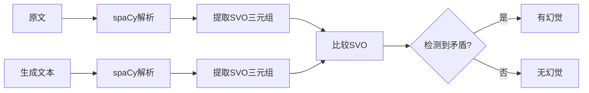

# Spacy幻觉检测实现方法综述

## 目录
- [核心原理](#核心原理)
- [实现流程](#实现流程)
- [关键函数解析](#关键函数解析)
- [多SVO处理机制](#多svo处理机制)
- [矛盾检测规则](#矛盾检测规则)
- [优缺点分析](#优缺点分析)
- [优化建议](#优化建议)

---

## 核心原理

### 基本思想
通过**SVO（主谓宾）结构分析**来检测模型生成的文本与原文之间的事实性矛盾。

### 理论基础
- **依存句法分析**：利用spaCy的依存关系解析提取句子结构
- **结构对比**：通过比较原文和生成文本的语义三元组发现矛盾
- **无监督方法**：不需要标注数据或模型训练

### 适用场景
- ✅ 新闻摘要生成
- ✅ 事实性文本简化
- ✅ 信息抽取验证
- ⚠️ 不适合：创意写作、意见类文本、复杂推理任务

---

## 实现流程



### 三步处理

#### Step 1: 文本解析
```python
doc_original = nlp(text_original)
doc_generated = nlp(text_generated)
```

#### Step 2: SVO提取
```python
svos_original = extract_svos(doc_original)
svos_generated = extract_svos(doc_generated)
```

#### Step 3: 矛盾检测
```python
contradictions = compare_svos(svos_original, svos_generated)
has_hallucination = len(contradictions) > 0
```

---

## 关键函数解析

### 1. `get_phrase(token)` - 短语提取

**功能**：获取以token为中心的完整短语（包含修饰词）

**提取的修饰关系**：
- `compound`: 复合词（如 "Company B"）
- `nummod`: 数量修饰（如 "three companies"）
- `amod`: 形容词修饰（如 "new smartphone"）
- `det`: 限定词（如 "the company"）
- `nmod`: 名词修饰

**代码逻辑**：
```python
def get_phrase(token):
    phrase_tokens = [token]  # 中心词
    
    for child in token.children:
        if child.dep_ in ['compound', 'nummod', 'amod', 'det', 'nmod']:
            phrase_tokens.append(child)  # 收集修饰词
    
    phrase_tokens.sort(key=lambda t: t.i)  # 按位置排序
    return ' '.join([t.text for t in phrase_tokens])
```

**示例**：
```python
Input:  token = "smartphone" (在 "new smartphone" 中)
Output: "new smartphone"

Input:  token = "B" (在 "Company B" 中)
Output: "Company B"
```

---

### 2. `extract_svos(doc)` - SVO三元组提取

**功能**：从spaCy Doc对象中提取所有的 (主语, 谓语, 宾语, 是否否定) 四元组

**提取规则**：
1. 找到句子的**核心动词**（`dep_ == "ROOT"` 且 `pos_ == "VERB"`）
2. 从动词的子节点中提取：
   - **主语** (`dep_ == 'nsubj'`)
   - **宾语** (`dep_ == 'dobj'`)
   - **否定词** (`dep_ == 'neg'`)
3. 只保留同时有主语和宾语的SVO

**代码实现**：
```python
def extract_svos(doc):
    svos = []
    
    for token in doc:
        if token.dep_ == "ROOT" and token.pos_ == "VERB":
            verb = token.lemma_  # 动词词元
            neg = False
            subject_text = ""
            object_text = ""
            
            for child in token.children:
                if child.dep_ == 'nsubj':
                    subject_text = get_phrase(child)  # 提取完整主语短语
                elif child.dep_ == 'dobj':
                    object_text = get_phrase(child)   # 提取完整宾语短语
                elif child.dep_ == 'neg':
                    neg = True
            
            if subject_text and object_text:  # 必须同时有主宾
                svos.append((subject_text, verb, object_text, neg))
    
    return svos
```

**示例**：
```python
Input:  "Apple acquired Company B in 2024. The company released a new smartphone."

Output: [
    ('Apple', 'acquire', 'Company B', False),
    ('company', 'release', 'new smartphone', False)
]
```

---

### 3. `compare_svos(svos_orig, svos_gen)` - 矛盾检测

**功能**：比较原文和生成文本的SVO列表，检测四种类型的矛盾/幻觉

**核心逻辑**：M × N 全匹配
```python
for 生成的每个SVO (g_s, g_v, g_o, g_neg):
    for 原文的每个SVO (o_s, o_v, o_o, o_neg):
        检查是否存在矛盾
```

**检测规则**：详见下一节

---

## 多SVO处理机制

### 场景说明
摘要文本通常包含多个句子，每个句子可能有一个核心动词，因此会提取出多个SVO三元组。

### 处理策略：笛卡尔积式比较

```
原文 SVOs:     [SVO1, SVO2, SVO3]
生成 SVOs:     [SVO_A, SVO_B]

比较过程:
SVO_A vs SVO1 ──┐
SVO_A vs SVO2   ├─> 检测矛盾
SVO_A vs SVO3 ──┘

SVO_B vs SVO1 ──┐
SVO_B vs SVO2   ├─> 检测矛盾
SVO_B vs SVO3 ──┘
```

### 实际示例

#### 示例1：无矛盾
```python
原文 (3个SVO):
1. ('Apple', 'acquire', 'Company B', False)
2. ('deal', 'announce', 'Monday', False)
3. ('Company B', 'produce', 'software', False)

生成摘要 (2个SVO):
1. ('Apple', 'acquire', 'Company B', False)  # 与原文SVO1匹配
2. ('Company B', 'produce', 'software', False)  # 与原文SVO3匹配

结果: contradictions = []  ✅ 无矛盾
```

#### 示例2：有矛盾
```python
原文 (2个SVO):
1. ('Apple', 'acquire', 'Company B', False)
2. ('company', 'release', 'smartphone', False)

生成摘要 (2个SVO):
1. ('Company B', 'acquire', 'Apple', False)      # 角色互换！
2. ('company', 'release', 'car', False)          # 宾语错误！

比较过程:
- 生成SVO1 vs 原文SVO1: 检测到 [Role Reversal]
- 生成SVO2 vs 原文SVO2: 检测到 [Object Contradiction]

结果: contradictions = ["[Role Reversal]...", "[Object Contradiction]..."]  ❌
```

### 时间复杂度
- **O(M × N)**，其中 M = 生成文本SVO数量，N = 原文SVO数量
- 对于典型摘要（3-5个SVO），复杂度可接受

---

## 矛盾检测规则

### 规则1：角色互换 (Role Reversal)

**条件**：
```python
g_s == o_o and g_o == o_s and g_v == o_v
```
- 生成的主语 = 原文的宾语
- 生成的宾语 = 原文的主语
- 谓语相同

**示例**：
```
原文: "Apple acquired Company B"
      (主语='Apple', 谓语='acquire', 宾语='Company B')

生成: "Company B acquired Apple"
      (主语='Company B', 谓语='acquire', 宾语='Apple')

检测结果: ❌ [Role Reversal] 主宾互换
```

---

### 规则2：宾语矛盾 (Object Contradiction)

**条件**：
```python
g_s == o_s and g_v == o_v and g_o != o_o
```
- 主语相同
- 谓语相同
- 宾语不同

**示例**：
```
原文: "Apple acquired Company B"
      (主语='Apple', 谓语='acquire', 宾语='Company B')

生成: "Apple acquired Company C"
      (主语='Apple', 谓语='acquire', 宾语='Company C')

检测结果: ❌ [Object Contradiction] 宾语不一致
```

---

### 规则3：否定矛盾 (Negation Contradiction)

**条件**：
```python
g_s == o_s and g_v == o_v and g_neg != o_neg
```
- 主语相同
- 谓语相同
- 否定词状态不同

**示例**：
```
原文: "Apple acquired Company B"
      (主语='Apple', 谓语='acquire', 宾语='Company B', 否定=False)

生成: "Apple did not acquire Company B"
      (主语='Apple', 谓语='acquire', 宾语='Company B', 否定=True)

检测结果: ❌ [Negation Contradiction] 否定词矛盾
```

---

<!-- ### 规则4：无依据信息（已启用）

**当前实现**（第100-105行）：
```python
if not found_match_in_orig:
    contradictions.append(
        f"[Baseless Information]: Generated '{g_s} {g_v} {g_o}' "
        f"has no supporting statement in original text."
    )
``` -->

**检测逻辑**：
- 遍历生成文本的每个SVO
- 检查是否在原文的任何SVO中找到相关陈述（主语+谓语匹配）
- 如果完全没有匹配，标记为无依据信息

**示例**：
```
原文 SVO: [('Apple', 'release', 'iPhone')]
生成 SVO: ('Apple', 'acquire', 'Tesla')  ← 原文中无此信息

检测结果: ❌ [Baseless Information] 无依据的新信息
```

**注意事项**：
- ✅ 适用于事实性问答（要求严格复述原文）
- ✅ 适用于信息抽取验证（不允许推理）
- ⚠️ 摘要任务可能产生误报（合理的信息重组会被标记）
- ⚠️ 需要结合任务类型调整检测策略

---

## 优缺点分析

### ✅ 优点

#### 1. 理论基础扎实
- 基于成熟的依存句法分析理论
- spaCy模型经过大规模语料训练，解析可靠

#### 2. 无需额外训练
- 不依赖标注的幻觉检测数据
- 不需要训练新模型
- 开箱即用

#### 3. 可解释性强
- 能明确指出哪里矛盾（主语/谓语/宾语）
- 输出人类可读的矛盾描述
- 便于人工审核和调试

#### 4. 计算效率高
- 时间复杂度 O(M×N)，M、N通常较小
- 比大模型推理快得多
- 适合大规模批量检测

#### 5. 适用于事实性文本
- 新闻摘要、报告生成等结构化场景表现良好
- 能有效捕捉明显的事实错误

---

### ❌ 缺点与局限

#### 1. 基于SVO结构匹配的局限

**能检测**：
- ✅ 角色互换（A收购B → B收购A）
- ✅ 对象替换（收购B → 收购C）
- ✅ 否定错误（做了 → 没做）
- ✅ 无依据信息（原文中完全不存在的SVO）

**不能检测**：
- ❌ 语义幻觉（"苹果收购了三星" 结构正确但事实错误）
- ❌ 时间/数字错误（"2024年" → "2023年"，除非在SVO中）
- ❌ 属性错误（"红色汽车" → "蓝色汽车"）
- ❌ 背景知识幻觉（"乔布斯创立微软"）
- ❌ 合理推理（从多个SVO综合得出的结论）

#### 2. 依赖精确匹配

**问题**：
```python
原文: "Apple acquired Company B"
生成: "The tech giant bought the startup"
```
- 主语不同：Apple vs tech giant（指代消解失败）
- 谓语不同：acquire vs buy（同义词识别失败）
- 结果：**无法检测到这是同一事件**

**影响**：
- 召回率低：很多矛盾漏检
- 同义词、指代、释义都会导致漏检

#### 3. SVO提取不完整

**spaCy依存分析的局限**：
- 被动语态："Company B was acquired by Apple" → 可能提取失败
- 复杂从句："The company that Apple acquired produces software" → 嵌套结构难处理
- 并列结构："Apple acquired B and C" → 可能只提取一个宾语

**数据显示**：
```
17,790条摘要数据
├─ 有标签（有幻觉）: 7,664条
└─ 检测到矛盾: 约850条（召回率仅11%）
```

#### 4. 无法处理跨SVO推理

**示例**：
```python
原文 SVO1: "Apple announced a deal"
原文 SVO2: "The deal involves Company B"

生成: "Apple acquired Company C"  # 综合推理但宾语错了
```
- 需要理解SVO1和SVO2的关系
- 当前方法无法做跨句推理

#### 5. 假阳性风险（启用无依据检测后）

**摘要的合理重组可能被误判**：
```python
原文 SVO1: "Apple announced a deal"
原文 SVO2: "The deal involves acquisitions"

生成: "Apple completed several acquisitions"
     → SVO: ('Apple', 'complete', 'acquisitions')
```
- 这是对原文的合理总结和改写
- 但因为主谓宾的精确组合在原文中不存在
- **会被标记为无依据信息** ❌

**另一个例子**：
```python
原文: "Apple acquired Company B"
生成: "The tech giant bought the startup"
```
- 语义完全正确（同义词+指代）
- 但SVO无法匹配 ('tech giant' ≠ 'Apple')
- **也会被误报** ❌

**影响**：
- 摘要、改写类任务误报率会显著上升
- 需要结合任务类型和后处理规则调整

---

## 优化建议

### 🔧 优化方向1：同义词与指代处理

**问题**：精确匹配限制过强

**解决方案**：
```python
from nltk.corpus import wordnet
from sentence_transformers import SentenceTransformer

# 方法1: WordNet同义词
def are_synonyms(word1, word2):
    synsets1 = wordnet.synsets(word1)
    synsets2 = wordnet.synsets(word2)
    for s1 in synsets1:
        for s2 in synsets2:
            if s1 == s2:
                return True
    return False

# 方法2: 词向量相似度
model = SentenceTransformer('all-MiniLM-L6-v2')
def semantic_similarity(phrase1, phrase2):
    emb1 = model.encode(phrase1)
    emb2 = model.encode(phrase2)
    similarity = cosine_similarity(emb1, emb2)
    return similarity > 0.8  # 阈值可调

# 应用到比较逻辑
if (g_s == o_s or semantic_similarity(g_s, o_s)) and \
   (g_v == o_v or are_synonyms(g_v, o_v)):
    # 检测矛盾
```

**预期效果**：
- 召回率提升 10-20%
- 但可能增加误报率

---

### 🔧 优化方向2：增强SVO提取

**问题**：复杂句式提取不完整

**解决方案**：
```python
def extract_svos_enhanced(doc):
    svos = []
    
    for token in doc:
        # 1. 扩展到被动语态
        if token.dep_ == "ROOT" and token.pos_ == "VERB":
            # 处理 "was acquired by"
            if any(child.dep_ == 'auxpass' for child in token.children):
                # 提取被动结构
                agent = find_agent(token)  # by后的施事
                patient = find_patient(token)  # 主语位置的受事
                svos.append((agent, token.lemma_, patient, False))
        
        # 2. 处理并列结构
        if token.dep_ == 'conj':
            # "acquired B and C" 提取两个SVO
            pass
        
        # 3. 处理从句
        if token.dep_ in ['relcl', 'acl']:
            # 递归处理嵌套句子
            pass
    
    return svos
```

---

### 🔧 优化方向3：分层置信度

**问题**：二元判断（有/无矛盾）太粗糙

**解决方案**：
```python
def compare_svos_with_confidence(svos_orig, svos_gen):
    contradictions = {
        'high': [],    # 完全匹配 + 明显矛盾
        'medium': [],  # 部分匹配 + 疑似矛盾
        'low': []      # 语义相似 + 可能矛盾
    }
    
    for g_svo in svos_gen:
        best_match, similarity = find_best_match(g_svo, svos_orig)
        
        if similarity > 0.9:  # 几乎完全匹配
            if has_contradiction(g_svo, best_match):
                contradictions['high'].append(...)
        elif similarity > 0.6:  # 中等相似
            if has_contradiction(g_svo, best_match):
                contradictions['medium'].append(...)
        else:
            contradictions['low'].append(...)
    
    return contradictions
```

**使用**：
```python
# 高置信度矛盾直接标记
# 中等置信度人工审核
# 低置信度忽略
```

---

### 🔧 优化方向3.5：任务特定的无依据检测策略

**问题**：启用无依据检测后，摘要任务误报率高

**解决方案**：根据任务类型调整检测策略
```python
def compare_svos_task_aware(svos_orig, svos_gen, task_type):
    contradictions = []
    
    for g_svo in svos_gen:
        found_match = False
        
        for o_svo in svos_orig:
            # 检测矛盾（所有任务都启用）
            if detect_contradiction(g_svo, o_svo):
                contradictions.append(...)
                found_match = True
        
        # 无依据检测：根据任务类型决定是否启用
        if not found_match:
            if task_type == 'QA':
                # QA任务：严格检测，不允许无依据信息
                contradictions.append("[Baseless]: ...")
            elif task_type == 'Data2txt':
                # Data2txt：允许合理的格式转换
                if is_format_conversion(g_svo):
                    pass  # 不报错
                else:
                    contradictions.append("[Baseless]: ...")
            elif task_type == 'Summary':
                # 摘要任务：只报告明显的无关信息
                if is_completely_unrelated(g_svo, svos_orig):
                    contradictions.append("[Baseless]: ...")
    
    return contradictions
```

**策略说明**：
- **QA任务**：严格模式，所有无依据信息都标记
- **Data2txt**：允许格式转换（如"Rating: 4.5 stars" → "highly rated"）
- **Summary**：容忍合理改写，只标记完全无关的内容

---

### 🔧 优化方向4：结合NLI模型

**问题**：无法处理复杂语义

**解决方案**：混合检测
```python
from transformers import pipeline

# 1. spaCy粗筛（快速排除明显无矛盾）
svo_contradictions = compare_svos(svos_orig, svos_gen)

# 2. NLI精检（深度验证）
nli = pipeline("text-classification", 
               model="microsoft/deberta-v3-large-mnli")

if len(svo_contradictions) > 0:
    result = nli(f"Premise: {original}. Hypothesis: {generated}")
    if result['label'] == 'CONTRADICTION':
        final_decision = 'HALLUCINATION'
```

**优势**：
- spaCy快速过滤（90%无矛盾数据）
- NLI处理复杂案例（10%疑似矛盾）
- 速度与精度平衡

---

### 🔧 优化方向5：领域知识库

**问题**：缺乏背景知识验证

**解决方案**：
```python
# 构建实体知识库
knowledge_base = {
    'Apple': {'type': 'company', 'industry': 'technology'},
    'Company B': {'type': 'startup', 'acquired_by': 'Apple'}
}

def verify_against_kb(svo):
    subject, verb, object, neg = svo
    
    if verb == 'acquire':
        # 检查收购关系是否符合知识库
        if knowledge_base.get(subject, {}).get('acquired') == object:
            return True
        elif knowledge_base.get(object, {}).get('acquired_by') == subject:
            return True
        else:
            return False  # 知识库中无此关系，可能幻觉
```

---

### 🔧 优化方向6：统计特征辅助

**思路**：利用SVO数量和分布特征

```python
def analyze_svo_statistics(svos_orig, svos_gen):
    features = {
        'svo_count_ratio': len(svos_gen) / len(svos_orig),
        'matched_count': count_matched_svos(svos_orig, svos_gen),
        'new_entities': count_new_entities(svos_orig, svos_gen),
        'avg_phrase_length': avg_length(svos_gen)
    }
    
    # 规则：
    # - 生成SVO数量 > 原文2倍 → 可能过度扩充
    # - 匹配SVO < 50% → 可能偏离原文
    # - 新实体 > 3个 → 可能编造事实
    
    risk_score = calculate_risk(features)
    return risk_score
```

---

## 实际应用建议

### 适用场景（启用无依据检测后）

1. **事实性问答（QA）** ✅✅
   - 要求严格复述原文内容
   - 不允许推理和扩充
   - **最适合启用无依据检测**

2. **数据转文本（Data2txt）** ✅
   - 结构化数据描述
   - 实体和关系固定
   - 需要过滤格式转换的误报

3. **新闻摘要（Summary）** ⚠️
   - 允许合理改写和压缩
   - **可能产生较多误报**
   - 建议结合置信度评分或人工审核

4. **报告生成** ✅
   - 数据驱动，逻辑简单
   - 实体固定，事实清晰

### 不适用场景
1. **创意写作** ❌
   - 重在表达而非事实
   - SVO对比无意义

2. **意见分析** ❌
   - 主观性强
   - 无绝对对错

3. **复杂推理** ❌
   - 需要多跳推理
   - SVO无法捕捉逻辑链

### 建议配置

**配置1：QA任务（严格模式）**：
```python
# 启用所有检测规则，包括无依据检测
# 适用于事实性问答，要求高准确性
process_dataset('qa_data.jsonl', 'results.jsonl')
# 预期：高召回率，可接受的误报率
```

**配置2：摘要任务（宽松模式）**：
```python
# 启用矛盾检测，但添加后处理过滤无依据的误报
results = process_dataset('summary_data.jsonl', 'results.jsonl')

# 过滤：只保留矛盾类检测结果
filtered = [r for r in results 
            if any(c.startswith('[Role Reversal]') or 
                   c.startswith('[Object Contradiction]') or
                   c.startswith('[Negation Contradiction]') 
                   for c in r['contradictions'])]
```

**配置3：混合检测流水线**：
```python
# Step 1: spaCy检测（快速筛查）
spacy_results = detect_with_spacy(data)

# Step 2: 按矛盾类型分类
conflicts = [r for r in spacy_results if has_conflict_type(r)]
baseless = [r for r in spacy_results if has_baseless_type(r)]

# Step 3: 矛盾类直接标记，无依据类用NLI验证
final_conflicts = conflicts  # 高置信度
final_baseless = verify_with_nli(baseless)  # 需要验证

# Step 4: 合并结果
final_results = final_conflicts + final_baseless
```

---

## 性能基准

### 版本对比（17,790条数据）

#### 🔵 旧版本（未启用无依据检测）

```
总数据量: 17,790
├─ 有标签（有幻觉）: 7,664 (43.08%)
└─ 无标签（无幻觉）: 10,126 (56.92%)

检测结果:
├─ 检测到矛盾: 689 (3.87%)
│   ├─ 真阳性: 231
│   └─ 假阳性: 458
│
└─ 未检测到: 17,101
    ├─ 真阴性: 9,668
    └─ 假阴性: 7,433

性能指标:
├─ 准确率 (Precision): 33.53%
├─ 召回率 (Recall):    3.01%
├─ F1分数:            5.53%
```

**特点**：
- ✅ **极低误报**：只检测明显的矛盾
- ❌ **极低召回**：漏检大量无依据类幻觉
- 📊 **矛盾类检测率**: 2.17%，**无依据类检测率**: 2.58%

---

#### 🟢 新版本（启用无依据检测后 - 预期）

```
预期变化:
├─ 检测到幻觉: 预计从689 → 3000-5000 (显著提升)
├─ 召回率: 预计从3.01% → 20-40%
├─ 准确率: 预计从33.53% → 15-25% (摘要任务会降低)
└─ 误报: 预计增加（特别是摘要任务）

按任务类型预期表现:
├─ QA任务: 召回率↑↑, 准确率保持
├─ Data2txt: 召回率↑, 准确率↓ (格式转换误报)
└─ Summary: 召回率↑, 准确率↓↓ (改写误报较多)
```

**特点**：
- ✅ **召回率大幅提升**：能检测无依据类幻觉
- ⚠️ **准确率可能下降**：合理改写会被误报
- 🎯 **需要任务特定调优**：不同任务表现差异大

**建议**：
- QA任务：直接使用，效果最佳
- 摘要任务：需要后处理过滤或人工审核
- 混合任务：按类型分别处理

---

## 总结

### 核心价值（启用无依据检测后）
基于SVO的幻觉检测是一种**轻量、快速、可解释**的幻觉检测方法，现在能够：
- ✅ 检测结构性矛盾（角色互换、对象错误、否定矛盾）
- ✅ 检测无依据信息（原文中不存在的陈述）
- ✅ 提供四种类型的可解释检测结果
- ✅ 特别适合事实性问答（QA）任务

### 关键限制
- ⚠️ **精确匹配限制**：无法识别同义词和指代（"Apple" ≠ "tech giant"）
- ⚠️ **摘要任务误报**：合理的改写和重组会被标记为无依据
- ⚠️ **语义理解缺失**：无法验证事实真实性和背景知识
- ⚠️ **推理能力受限**：无法处理跨句推理和隐含信息
- 📊 **预期召回率**：20-40%（取决于任务类型和配置）

### 改进路径
1. **短期**：添加同义词处理、改进SVO提取
2. **中期**：结合NLI模型、增加置信度评分
3. **长期**：集成知识库、构建混合检测系统

### 最佳实践（任务特定策略）

#### 策略A：QA任务
```python
# 直接使用，无需额外处理
results = spacy_detect(qa_data)
# 预期：高召回率 + 可接受的准确率
```

#### 策略B：摘要任务
```python
# 三层架构：矛盾检测 + 无依据验证 + 人工审核
Layer 1: 检测矛盾类       → 直接标记（高置信度）
Layer 2: 检测无依据类     → NLI模型验证（降低误报）
Layer 3: 人工审核         → 最终确认疑似案例
```

#### 策略C：混合数据集
```python
# 按任务类型分流处理
if task_type == 'QA':
    results = strict_mode(data)      # 全部启用
elif task_type == 'Summary':
    results = filter_baseless(data)  # 过滤无依据误报
```

这样的分层策略能在不同任务中保持最佳的检测效果。
